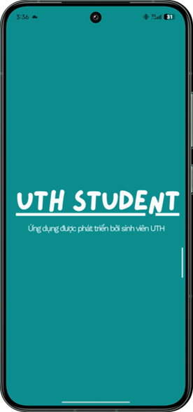
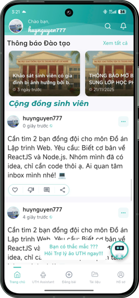
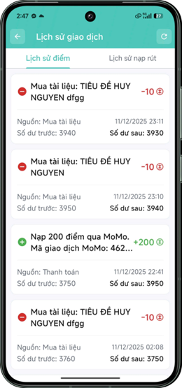
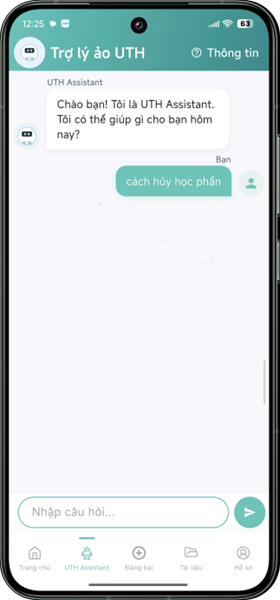
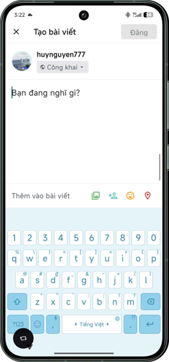
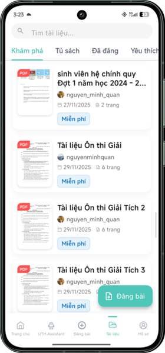
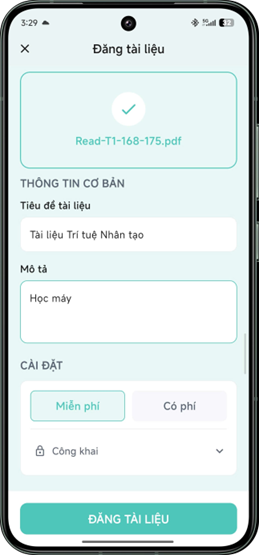
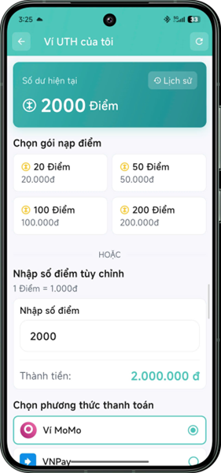
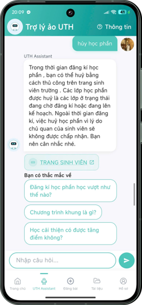

# UTH-Student

> Ứng dụng hỗ trợ toàn diện cho sinh viên Đại học Tây Thiên - Kết nối học tập, quản lý tài chính, chia sẻ tài liệu và nhận hỗ trợ từ AI Assistant.

---

## Tính năng chính

| Tính năng | Mô tả |
|-----------|-------|
| **Nạp tiền điểm** | Quản lý số dư điểm, nạp tiền thông qua nhiều phương thức thanh toán |
| **Lịch sử giao dịch** | Theo dõi chi tiết lịch sử nạp tiền và giao dịch |
| **UTH Assistant** | Chatbot AI hỗ trợ trả lời thắc mắc về học tập và quy chế nhà trường |
| **Thư viện tài liệu** | Khám phá, tìm kiếm và tải xuống tài liệu học tập từ cộng đồng |
| **Chia sẻ tài liệu** | Đăng tải tài liệu, bài viết của riêng mình để giúp đỡ sinh viên khác |
| **Cộng đồng** | Tạo bài viết, kết nối với các sinh viên khác, thảo luận học tập |

---

## Giao diện ứng dụng

### Màn hình chính

  
  
  

### Các tính năng

  
  
  

### Quản lý tài liệu

  
  

### Ví & Quản lý số dư

  
  

### Trợ lý ảo UTH Assistant

  
    

---

## Công nghệ sử dụng

- **Frontend:** React Native / Flutter
- **Backend:** Node.js / Python
- **Database:** Firebase / MongoDB
- **AI:** Chatbot Rasa

---

## Cài đặt

### Yêu cầu hệ thống
- Android 6.0+
- Kết nối Internet

### Hướng dẫn cài đặt
1. Tải ứng dụng từ Google Play Store hoặc App Store
2. Đăng nhập bằng tài khoản sinh viên UTH
3. Bắt đầu sử dụng các tính năng

---

## Đóng góp

Chúng tôi luôn hoan nghênh các ý kiến đóng góp và báo cáo lỗi. Vui lòng liên hệ qua email hoặc mở issue trên repository.

---

## Liên hệ & Hỗ trợ

- **Email:** hnv277s@gmail.com

---

## Giấy phép

Dự án này được cấp phép dưới [LICENSE](LICENSE) - Tất cả quyền được bảo lưu © 2025
