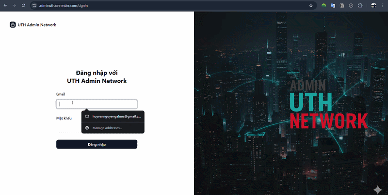

<div align="center">

#UTH-Student

**Nền tảng toàn diện hỗ trợ sinh viên - Kết nối học tập, chia sẻ tài liệu & AI Assistant**

[](.)
[](LICENSE)
[](.)

[Tải APK](#-cài-đặt--hướng-dẫn) • [Admin Dashboard](#-admin-dashboard) • [Demo](#-demo-video)

</div>

---

##  Mục lục

- [ Tính năng nổi bật](#-tính-năng-nổi-bật)
- [ Công nghệ sử dụng](#️-công-nghệ-sử-dụng)
- [ Giao diện & Demo](#-giao-diện--demo)
- [ Admin Dashboard](#-admin-dashboard)
- [ Cài đặt & Hướng dẫn](#-cài-đặt--hướng-dẫn)
- [ Đóng góp](#-đóng-góp)
- [ Liên hệ](#-liên-hệ)

---

##  Tính năng nổi bật

|  Tính năng |  Mô tả |
|-----------|-------|
|  **Nạp tiền điểm** | Quản lý số dư điểm, nạp tiền thông qua nhiều phương thức thanh toán |
|  **Lịch sử giao dịch** | Theo dõi chi tiết lịch sử nạp tiền và giao dịch với thống kê real-time |
|  **UTH AI Assistant** | Chatbot AI thông minh trả lời thắc mắc về học tập, quy chế nhà trường |
|  **Thư viện tài liệu** | Khám phá, tìm kiếm và tải xuống tài liệu học tập từ cộng đồng |
|  **Chia sẻ tài liệu** | Đăng tải bài viết, tài liệu riêng để hỗ trợ sinh viên khác |
|  **Cộng đồng sinh viên** | Tạo bài viết, kết nối, thảo luận học tập với bạn cùng trường |

---

##  Công nghệ sử dụng

|  Layer |  Công nghệ |
|---------|-----------|
| **Frontend** | ReactJS / Flutter |
| **Backend** | Node.js / Python |
| **Database** | Firebase / MongoDB |
| **AI/Chatbot** | Rasa |
| **Hosting** | Render (Admin), Firebase/Cloud Services |

---

##  Giao diện & Demo

###  Màn hình chính
<div align="center">
  
  
  
</div>
<p align="center"><em>Splash • Trang chủ • Lịch sử giao dịch</em></p>

###  Tính năng Cộng đồng & Tài liệu
<div align="center">
  
  
  
</div>
<p align="center"><em>AI Assistant • Tạo bài viết • Thư viện tài liệu</em></p>

###  Quản lý ví & Tài liệu
<div align="center">
  
  
  
</div>
<p align="center"><em>Ví điện tử • Đăng tài liệu • Chat AI</em></p>

###  Video Demo - Mobile App
<div align="center">
  
</div>
<p align="center"><em>Toàn cảnh ứng dụng mobile</em></p>

---

##  Admin Dashboard

Quản lý toàn diện hệ thống ứng dụng, người dùng, giao dịch và nội dung.

🔗 **[Truy cập Admin Panel](https://adminuth.onrender.com/)**

###  Tài khoản Demo
| Thông tin | Chi tiết |
|-----------|---------|
| **Email** | admin1@system.com |
| **Mật khẩu** | admin123 |

### Chức năng Admin
-  **Dashboard** - Thống kê doanh thu, người dùng, hoạt động hệ thống
-  **Quản lý người dùng** - Xem, chỉnh sửa, xóa tài khoản sinh viên
-  **Quản lý hệ thống** - Theo dõi quản lý hoạt động, nhân sự làm việc trong hệ thống, 
-  **Quản lý nhân sự** - Gán role, phân quyền truy cập
-  **Quản lý tài liệu** - Duyệt, kiểm duyệt nội dung từ cộng đồng
-  **Quản lý tài chính** - Theo dõi giao dịch, thanh toán, doanh thu
-  **Quản lý báo cáo** - Quản lý báo cáo các nội dung không lành mạnh trên ứng dụng

### 📸 Giao diện Admin

#### Dashboard & Thống kê
<div align="center">
  
</div>

#### Báo cáo & Doanh thu
<div align="center">
  
</div>

#### Quản lý Người dùng
<div align="center">
  
</div>

#### Quản lý Tài chính
<div align="center">
  
</div>

####  Quản lý Hệ thống
<div align="center">
  
  
</div>

###  Video Demo - Admin Dashboard
<div align="center">
  
</div>


---

##  Cài đặt & Hướng dẫn

###  Yêu cầu hệ thống
- **Android:** 6.0+ (API level 23)
- **iOS:** 12.0+ (nếu hỗ trợ)
- **Kết nối:** Internet ổn định
- **RAM:** Tối thiểu 2GB

###  Hướng dẫn cài đặt

#### 1️ Tải ứng dụng
- [Tải file APK từ GitHub Releases](.)

#### Sử dụng ứng dụng
-  Đăng ký/Đăng nhập bằng tài khoản sinh viên UTH
-  Khám phá các tính năng từ menu chính
-  Hỏi AI Assistant nếu có thắc mắc

---

##  Đóng góp

Chúng tôi luôn hoan nghênh:
-  **Báo cáo lỗi** (Bug reports)
-  **Ý kiến cải thiện** (Feature suggestions)

Vui lòng [mở Issue hoặc liên hệ](mailto:hnv277s@gmail.com) để đóng góp.

---

##  Liên hệ

-  **Email:** hnv277s@gmail.com
-  **Admin Dashboard:** https://adminuth.onrender.com/
-  **APK Download:** [GitHub Releases](.)

---

##  Giấy phép

Dự án này được cấp phép dưới **MIT License** - Tất cả quyền được bảo lưu © 2025

```
Copyright (c) 2025 UTH-Student

Permission is hereby granted, free of charge, to any person obtaining a copy
of this software and associated documentation files (the "Software"), to deal
in the Software without restriction, including without limitation the rights
to use, copy, modify, merge, publish, distribute, sublicense, and/or sell
copies of the Software.
```

---

<div align="center">

**Made with ❤️ for UTH Students**

⭐ Nếu bạn thích dự án này, please give us a star! ⭐

</div>
